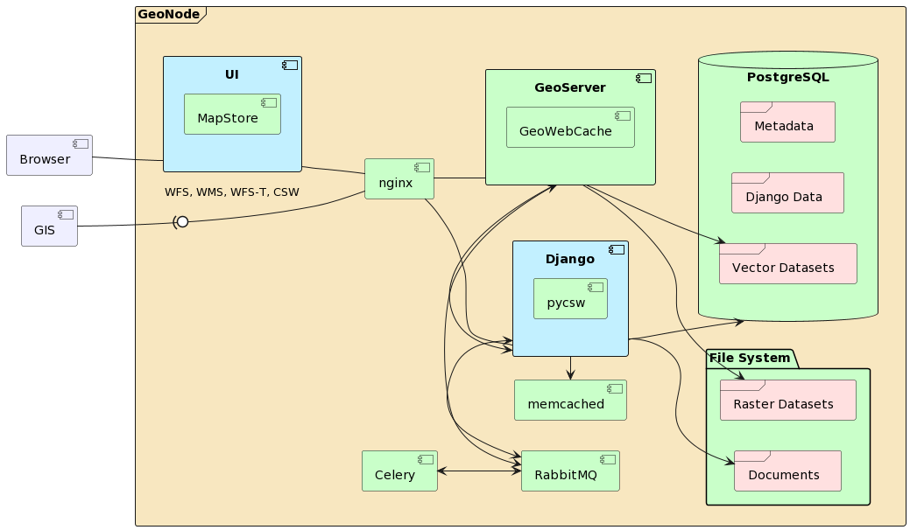

# Thünen Atlas, GeoNode Instance 

This document will guide you through the development setup of the Thünen Atlas which is based on [GeoNode](https://geonode.org/), a spatial content management system.
The needed components are available as [Docker](https://www.docker.com/) base images and will be customized and set up and run via the [docker-compose](https://docs.docker.com/compose/) tool.

## Component Overview

Here is a short overview of the installed components and how they are connected.



The components are:

- **Django:** The actual GeoNode component.
It exposes a [pyCSW API](https://pycsw.org/) and the GeoNode API.
- **Celery:** [Celery](https://docs.celeryq.dev/en/stable/) forms the asynchronuous task queue of GeoNode.
- **GeoServer:** [GeoServer](https://geoserver.org/) is the backend server of GeoNode for sharing geospatial data.
It exposes OGC APIs such as WMS, WFS, etc. 
- **Nginx:** [Nginx](https://nginx.com) serves as advanced load balancer, web server and reverse proxy to all GeoNode components.
- **PostgreSQL:** GeoNode and GeoServer are using [PostgreSQL](https://www.postgresql.org)  with the geospatial extension [PostGIS](https://postgis.net) as the database.


## Thünen Specific Repositories

Thünen Atlas maintains own repositories holding all code changes, fixes, and adjustments which are not (yet) part of [GeoNode upstream](https://github.com/geonode/geonode) and related projects as genonde-mapstore-client.

Most important repositories are

* **thuenen_atlas**: The [thuenen_atlas repository](https://github.com/Thuenen-GeoNode-Development/thuenen_atlas) assembles all components and provides the development setup
* **GeoNode**: A [fork of GeoNode](https://github.com/Thuenen-GeoNode-Development/geonode) holding code changes not (yet) merged with upstream.
* **geonode-mapstore-client**: A [fork of geonode-mapstore-client](https://github.com/Thuenen-GeoNode-Development/geonode-mapstore-client) which holds UI adjustments not (yet) merged with upstream. 
* **MapStore2**: A [fork of MapStore2](https://github.com/Thuenen-GeoNode-Development/MapStore2) holding code changes not (yet) merged with upstream.
* **Apps and Extensions**:
  * **externalapplications**: The [externalapplications app](https://github.com/GeoNodeUserGroup-DE/contrib_externalapplications) is a GeoNode contrib app which adds external applications as new resource_type.
  * **atlas**: The atlas app, currently part of [Thünen Atlas repository](https://github.com/Thuenen-GeoNode-Development/thuenen_atlas), adds template pages for which an admin can add curated content to.
  * **importer-datapackage**: [A python module](https://github.com/GeoNodeUserGroup-DE/importer-datapackage) which adds a non-spatial data handler for [the geonode-importer](https://github.com/geononde/geonode-importer).

 Main goal of all forks is, to stay as close to the upstream as possible.
 Some repositories are maintained in a repository of the [German GeoNode user group](https://github.com/GeoNodeUserGroup-DE).


## Quick Start

Clone the repository.

```sh
git clone --recurse-submodules https://github.com/Thuenen-GeoNode-Development/thuenen_atlas -b thuenen_4.x
cd thuenen_atlas
```

> :bulb: **Note**
>
> `geonode-mapstore-client` is a huge repository.
> If you want to keep a small footprint, add `--shallow-submodules` when cloning the repository.

To build and start GeoNode, run:

```sh
docker-compose up -d --build 
```

You can follow the logs: `docker-compose logs -f <optional-service-name>`.
Locate your browser to http://172.18.0.1/ to access the GeoNode UI.


> :bulb: **Note**
>
> We make GeoNode available under IP `172.18.0.1` so that no components try to communicate via `localhost` (each container has their own loopback interface).


### TLS Config

If you want to configure a TLS certificate, you can mount key and cert as `pem`s in the `geonode` service within the `docker-compose.yml` file.
Uncomment the corresponding lines:

 ```sh
 volumes:
    - nginx-confd:/etc/nginx
    - statics:/mnt/volumes/statics
    # Link to a custom certificate here
    #- <path-to-cert>.pem:/geonode-certificates/autoissued/fullchain.pem
    #- <path-to-key>.pem:/geonode-certificates/autoissued/privkey.pem
 ```


To shutdown GeoNode, run:

```sh
docker-compose down
```

To remove all volumes you have to append the `-v` flag.


## Configuration

Configuration can done in `./.env` file.
You can make a copy from `./.env.sample`.
We keep the contents to a bare minimum needed to run the whole setup.
This configuration is used during `docker-compose` runs, and also when running the devcontainer.

There is also the `./geonode/settings.py` which can be used to adjust Django settings, like logging, context processors, installed apps and more.
In the `django` container `./geonode/settings.py` is the main `DJANGO_SETTINGS_MODULE`, pre-loads the default settings and becomes available as `settings_override.py`.

For more information about configuring GeoNode, consult the [Settings reference](https://docs.geonode.org/en/master/basic/docker_env_vars/index.html#dockerenvvars) of the GeoNode documentation.


## Development

As listed above, `thuenen_atlas` comprises GeoNode components which include customizations.
To get an overview, you'd simply `git diff <my_branch>..<upstream_branch> [-- [^]spec]` or compare it via GitHub:

* [MapStore2](https://github.com/Thuenen-GeoNode-Development/MapStore2/compare/thuenen_2024.01.xx..geosolutions-it:2024.01.xx)
* [geonode-mapstore-client](https://github.com/Thuenen-GeoNode-Development/geonode-mapstore-client/compare/thuenen_4.3.x..GeoNode:4.3.1)
* [GeoNode](https://github.com/Thuenen-GeoNode-Development/geonode/compare/thuenen_4.x..geonode:4.3.1)


### DevContainers

If you are using vs-code as an IDE you can start [the devcontainer setup](https://containers.dev/).

Make sure, you have installed the [Dev Containers extension](https://marketplace.visualstudio.com/items?itemName=ms-vscode-remote.remote-containers).
Build and open the devcontainer and wait until everything has started.
After downloading and building the images, the terminal prints when containers are starting:

```sh
... # cut for brevity

[188981 ms] Start: Run: docker-compose --project-name geonode -f /home/ridoo/data/coding/projects/thuenen-atlas/thuenen_atlas/docker-compose.yml -f /home/ridoo/data/coding/projects/thuenen-atlas/thuenen_atlas/.devcontainer/docker-compose.yml -f /home/ridoo/.config/Code - Insiders/User/globalStorage/ms-vscode-remote.remote-containers/data/docker-compose/docker-compose.devcontainer.build-1694764280181.yml -f /home/ridoo/.config/Code - Insiders/User/globalStorage/ms-vscode-remote.remote-containers/data/docker-compose/docker-compose.devcontainer.containerFeatures-1694764463670.yml up -d
[+] Running 16/16
 ✔ Network geonode_default          Created                                0.2s 
 ✔ Volume "geonode-gsdatadir"       Create...                              0.0s 
 ✔ Volume "geonode-backup-restore"  C...                                   0.0s 
 ✔ Volume "geonode-statics"         Created                                0.0s 
 ✔ Volume "geonode-dbbackups"       Create...                              0.0s 
 ✔ Volume "geonode-dbdata"          Created                                0.0s 
 ✔ Volume "geonode-data"            Created                                0.0s 
 ✔ Volume "geonode-rabbitmq"        Created                                0.0s 
 ✔ Volume "geonode-tmp"             Created                                0.0s 
 ✔ Container gsconf4geonode         Started                                0.1s 
 ✔ Container nginx4geonode          Started                                0.1s 
 ✔ Container db4geonode             Started                                0.1s 
 ✔ Container rabbitmq4geonode       Starte...                              0.1s 
 ✔ Container geoserver4geonode      Creat...                               0.1s 
 ✔ Container django4geonode         Created                                0.0s 
 ✔ Container celery4geonode         Created                                0.0s
```

When seeing the above output, you can watch logging via `docker-compose logs -f`.

The devcontainer setup does not start GeoNode automatically.
Once the container is ready, you can press `F5` to start debugging GeoNode.
Locate your browser to `http://172.18.0.1:8001`.

> :bulb: **Note**
>
> In the devcontainer setup, GeoNode is not available via nginx!
> Starting GeoNode in devcontainer actually runs `python manage.py runserver` which starts a lightweight development web server based on WSGI.
> However, GeoServer is routed via nginx and available from http://172.18.0.1/geoserver.


### Develop GeoNode UI

The GeoNode UI is written in ReactJS and uses components from the MapStore2 Web framework.
As GeoNode is a Django project, integration of the UI works as a django app.
This django app is implemented by the `geonode-mapstore-client` project.
At the moment, Thünen Atlas also provides [an own fork for UI adjustments](https://github.com/Thuenen-GeoNode-Development/geonode-mapstore-client).


The UI is a single page application and (mostly) communicates with GeoNode via API.
There are exceptions where (still) Django templates are used.

To start developing the UI, you can [follow the official development guide](https://github.com/geosolutions-it/geonode-mapstore-client/blob/master/docs/development.md).

In devcontainer setup, the vs-code debug launcher [opens port `8001` for HTTP connections](https://github.com/Thuenen-GeoNode-Development/geonode/blob/thuenen_4.x/uwsgi.ini#L3).
Configure that port in your `./geonode_mapstore_client/client/.env` file:

```sh
DEV_SERVER_PROTOCOL=http
DEV_SERVER_HOSTNAME=localhost
DEV_TARGET_GEONODE_HOST=localhost:8001
```

Then build and start the client:

```sh
cd ./geonode_mapstore_client/client
npm install
npm start
```

Make sure to use node version `12.x` (e.g. via `nvm`).


> :bulb: **Note**
>
> Do not commit compiled JavaScript!
>
> To make code review easier and support branch maintenance, we let GitHub build the client and create a PR dedicated to the compiled JavaScript.
> After merging the PR you can pull the latest changes again to sync with the remote repo.
> This is necessary to not clutter any merge with thousands of changes in the `static/mapstore/dist` folder.

Once an automated build PR has been merged, the geonode-mapstore-client submodule should be updated to point to a the new version.
To do this run the command

```sh
git submodule update --remote
```

Alternatively, you may want to point to a specific submodule version:

```sh
cd docker/geonode/geonode-mapstore-client
git checkout <commit-id>
```


### Working with Git Submodules

We leverage [Git submodules](https://git-scm.com/book/en/v2/Git-Tools-Submodules) to tie dependent modules laying in different repositories.
For the Thünen Atlas project these are (for the time of writing this):

* [./docker/geonode/geonode-mapstore-client](./docker/geonode)
* [./geonode/apps/externalapplications](./geonode/apps)

You can get an overview of all submodules by running:

```sh
git submodule status
```

If you have not initiated the submodules when [cloning the repository](#quick-start) the directories appear empty.
You have to initiate the submodules before you can build and run Thünen Atlas.

```sh
git submodule update --remote --init
```

You would have to include the `--recursively` flag as `geonode-mapstore-client` includes `MapStore2` as submodule as well.

Git keeps track of a submodule by its commit hash. 
In case you want to develop from within the submodule directory switch to a dedicated branch before committing.
If there are remote changes update the parent project in your local working copy:

```sh
git submodule update --remote
```

You can find a lot of good readings on Git submodules, either in the [official Git Submodule reference](https://git-scm.com/book/en/v2/Git-Tools-Submodules) or [by Atlassian](https://www.atlassian.com/git/tutorials/git-submodule).


### Working with Feature Branches

During development we follow the goal to contribute features to the upstream projects.
This means, we have to keep feature relevant commits in a dedicated branch which later can be used to create pull requests.
Those feature branches get a `thuenen_<feature name>` suffix, whereas `<feature name>` should be a good name describing or referencing the feature.

The following workflow proposes how to develop feature branches based on a dedicated commit/tag and how to merge them onto the thuenen development branch.

1. Create a feature branch from dedicated commit: `git checkout -b thuenen_<feature name> <commit-id>`.
   Do not use a commit-id from a thuenen branch as it already contains other commits.
   For GeoNode for example, you can use the tag `4.1.3` or its commit hash.
1. Make your commits on that feature branch.
1. To merge the feature, `git switch` to main development branch and do a `git merge --no-ff thuenen_<feature name>`.
   Do not rebase the feature branch onto the main development branch!
   This would smudge the dedicated commit you created the feature branch from.

## Docker Images

All images are based on pre-built base images.
This ensure more performant builds regarding to time and size.
Docker provides concepts to extend and adjust the setup, for example via volume mounts, or building atop of those images.


> :bulb: **Base Images**
>
> As for today, tags of official GeoNode images are not as stable as we would expect from an upstream project.
> Therefore, we rely on images built from [the `52north/geonode` fork](https://github.com/52north/geonode/tree/52n-master) of GeoNode upstream.
> This way, we can track upstream changes (to stay close to the upstream) and guarantee stable tags at the same time.
>
> However, as said before, Thünen Atlas has unmerged changes on GeoNode core, and uses a project specific image which is built from [a project specific fork of GeoNode](https://github.com/Thuenen-GeoNode-Development/geonode).


The project prepares `Dockerfile`s for each component to allow a well-defined extension structure:

```sh
docker
├── geonode                         # Extension point for GeoNode
│   ├── Dockerfile                  # Uses 52north/geonode_thuenen
│   ├── geonode-mapstore-client     # Submodule for the GeoNode UI
│   └── requirements.txt            # Further packages to install
├── geoserver                       # Extension point for GeoServer
│   └── Dockerfile                  # Uses 52north/geonode-geoserver
├── geoserver_data                  # Extension point for GeoServer data dir
│   └── Dockerfile                  # Uses geonode/geonode_data (may change when tagging becomes unstable as well)
├── nginx                           # Extension point for Nginx
│   └── Dockerfile                  # Uses geonode/geonode-nginx
└── postgresql                      # Extension point for Postgres
    └── Dockerfile                  # Uses geonode/postgis (may change when tagging becomes unstable as well)
```

## Testing

To run the tests a running GeoNode instance is needed.
All test data is stored in separate databases which are prefixed by `TEST_`. 

Before starting tests you have to prepare test databases.
Once devcontainer setup is started, just run the command:

```sh
docker-compose exec db sh /docker-entrypoint-initdb.d/prepare-testdb.sh
```

Verify if `test_geonode` and `test_geonode_data` is available.

```sh
docker-compose exec -e PGPASSWORD=postgres db psql -U postgres -c \\l
```

Afterwards the necessary test databases and users have been created.
Now, you can start the tests by running:

```sh
python manage.py test -v 3 --keepdb <[optional] the module to test>
```
