This document provides instructions on adding a subsite and working with it for UI customization.

For documentation on the subsites module see: https://github.com/geosolutions-it/geonode-subsites and https://docs.geonode.org/en/4.2.5/advanced/contrib/subsites/index.html

For detailed information on geonode theming see: https://docs.geonode.org/en/master/basic/theme/index.html

# Adding a New Subsite

In order to add a new subsite *subsite_name*:
1. Add a folder at `thuenen_atlas/geonode/templates/subsites/*subsite_name*/`
2. Create folders ``*subsite_name*/templates/geonode-mapstore-client/snippets`
3. For extending the base template file, add `snippets/custom_theme.html` (see theming guide linked above for details)
or ovewrite individual section templates like `brand_navbar.html`, `footer.html` etc.
4. In order for the subsite custom theming to take effect, it needs to be configured through Django admin panel at `http://{host}/admin`

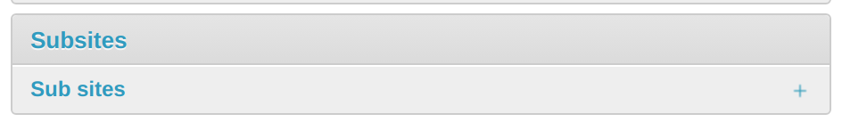

5. In the panel navigate to the subsite section at `http://{host}/admin/subsites/` and add a new subsite

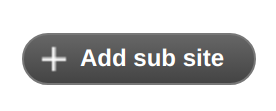

6. Site name has to be *subsite_name* (just as the folder name). 

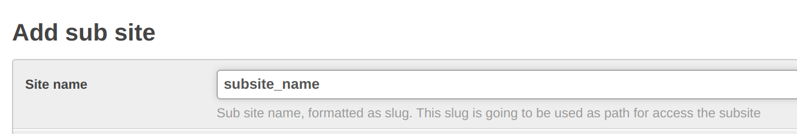

7. Within the subsite settings, add a theme (any name)

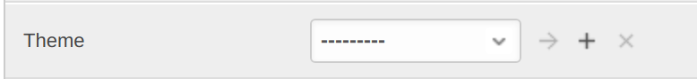
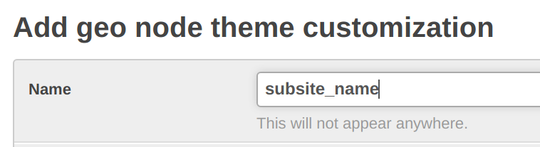

8. Subsite should now be available at `http://{host}/*subsite_name*/`

## Snippets that could be overridden
The full list of snippets that could be overridden is as following:
+ `brand_navbar.html`
+ `custom_theme.html`
+ `footer.html`
+ `header.html`
+ `hero.html`
+ `language_selector.html`
+ `loader_style.html`
+ `loader.html`
+ `menu_item.html`
+ `search_bar.html`
+ `topbar.html`

Their content could be examined at `geonode/geonode-mapstore-client/geonode_mapstore_client/templates/geonode-mapstore-client/snippets`.

# Subsites in the Admin Panel 
There are some customizations that are possible directly from the admin panel at `http://{host}/admin`. For that, within the subsite settings,
go to the settings of the theme, it will allow to 
1. Change the main logo (Field "Logo")

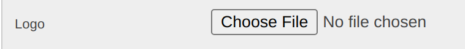

2. Change the title of the page (Field "Jumbotron title")
3. Chage the subtitle of the page (Field "Jumbotron content")

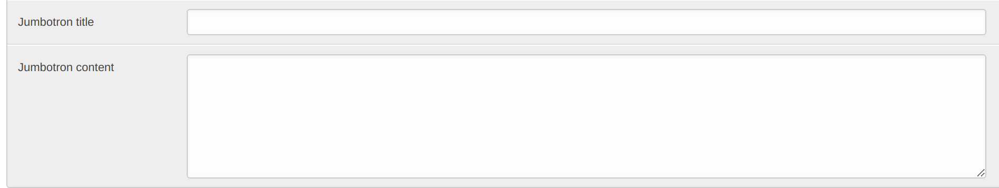

4. Add custom styling (Field "Custom CSS rules")

The field "Custom CSS rules" overrides custom styles (`custom_theme.html`) defined for [the default `:root` selector](https://developer.mozilla.org/en-US/docs/Web/CSS/:root).
Styling can be overridden by using the more concrete `.msgapi .gn-theme` css selector as shown with the following:

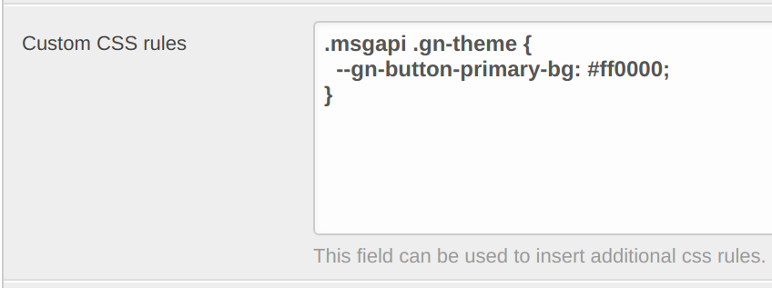

# Existing subsites
This section describes steps for proper configuration of the subsites that are already part of the repository

## HoliSoils
1. Add a new subsite in the admin panel. Site name has to be "holisoils"
2. Add a theme.
3. Within a theme, add a logo. Use "holisoils_logo_header.png" file in templates/subsites/statics
4. Set Jumbotron title to "HoliSoils"
5. Set Jumbotron content to "Working together for forest soils"

### Adding a "Subsites" button to the navigation bar
It is possible to add a navigation dropdown menu that looks this:
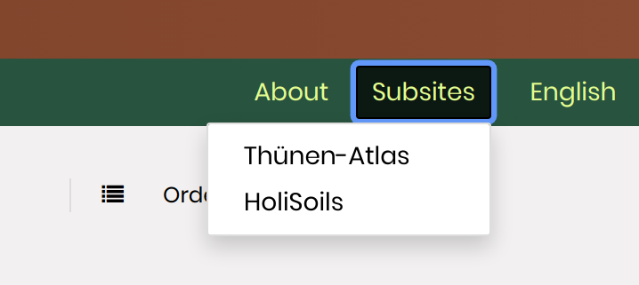

In order to do that, two step are necessary:
1. In the admin panel, go to "Menus". Add a new menu, set Title to "Subsites", Placeholder to "TOPBAR_MENU_RIGHT", Order to "2".

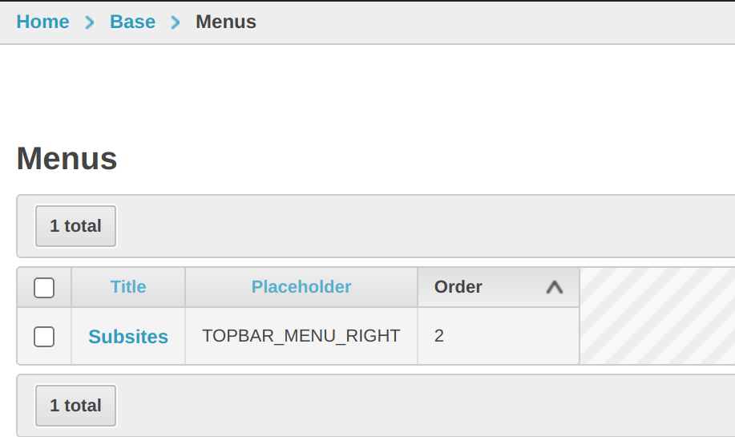

2. In the admin panel, go to "Menu items". Add two items. First with a title "Thünen-Atlas", menu specified to be "Subsites", order "1" and URL to be "/", leave "blank target" checkbox blank. Second should be titled "HoliSoils", have menu "Subsites", URL "/holisoils" and "blank target" also unchecked.

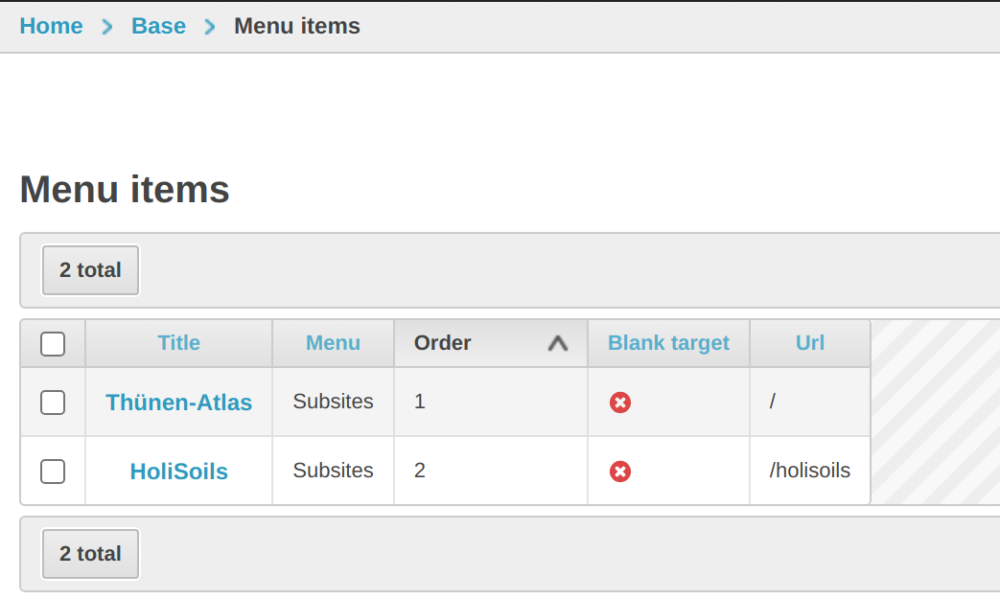

The button would appear both on the Atlas home page, as well as all subsite pages. 