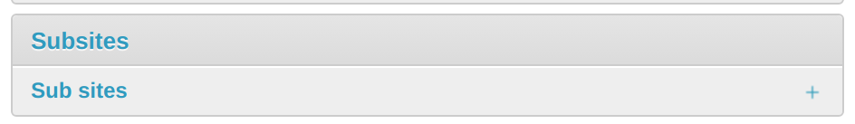
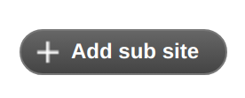
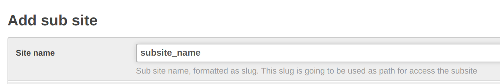
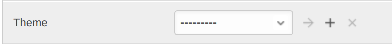
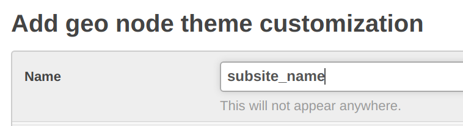
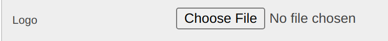
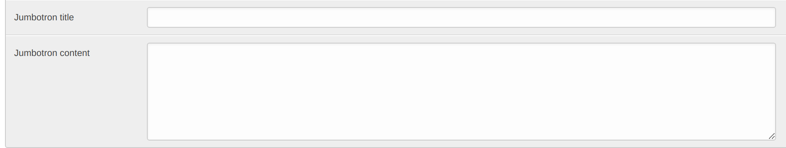
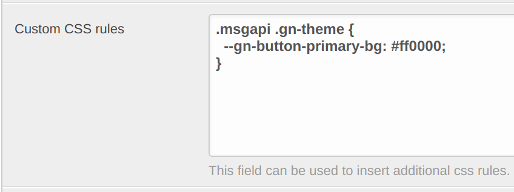

This document provides instructions on adding a subsite and working with it for UI customization.

For documentation on the subsites module see: https://github.com/geosolutions-it/geonode-subsites
For detailed information on geonode theming see: https://docs.geonode.org/en/master/basic/theme/index.html

# Adding a New Subsite

In order to add a new subsite *subsite_name*:
1. Add a folder at thuenen_atlas/geonode/templates/subsites/*subsite_name*/
2. Create folders /*subsite_name*/templates/geonode-mapstore-client/snippets
3. For extending the base template file, add snippets/custom_theme.html (see theming guide linked above for details)
or ovewrite individual section templates like brand_navbar.html, footer.html etc.
4. In order for the subsite custom theming to take effect, it needs to be configured through Django admin panel at http://{host}/admin 



5. In the panel navigate to the subsite section at http://{host}/admin/subsites/ and add a new subsite



6. Site name has to be *subsite_name* (just as the folder name). 



7. Within the subsite settings, add a theme named *subsite_name*




8. Subsite should now be available at http://{host}/*subsite_name*/


## Snippets that could be overridden
The full list of snippets that could be overridden is as following:
+ brand_navbar.html
+ custom_theme.html
+ footer.html
+ header.html
+ hero.html
+ language_selector.html
+ loader_style.html
+ loader.html
+ menu_item.html
+ search_bar.html
+ topbar.html

Their content could be examined at geonode/geonode-mapstore-client/geonode_mapstore_client/templates/geonode-mapstore-client/snippets


# Subsites in the Admin Panel 
There are some customizations that are possible directly from the admin panel at http://{host}/admin. For that, within the subsite settings,
go to the settings of the theme, it will allow to 
1. Change the main logo (Field "Logo")



2. Change the title of the page (Field "Jumbotron title")
3. Chage the subtitle of the page (Field "Jumbotron content")



4. Add custom styling (Field "Custom CSS rules")

This field is overiding ```geonode/templates/subsites/subsite_name/geonode-mapstore-client/snippets/custom_theme.html```

In order for those styles to take effect, ```custom_theme.html``` should end with the following:
```
<style>
  {{ custom_theme.extra_css }}
</style>
```

Then you can use the admin panel to update styles like this:

